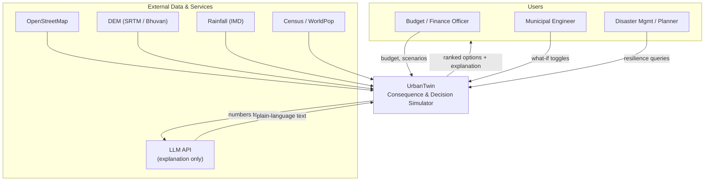
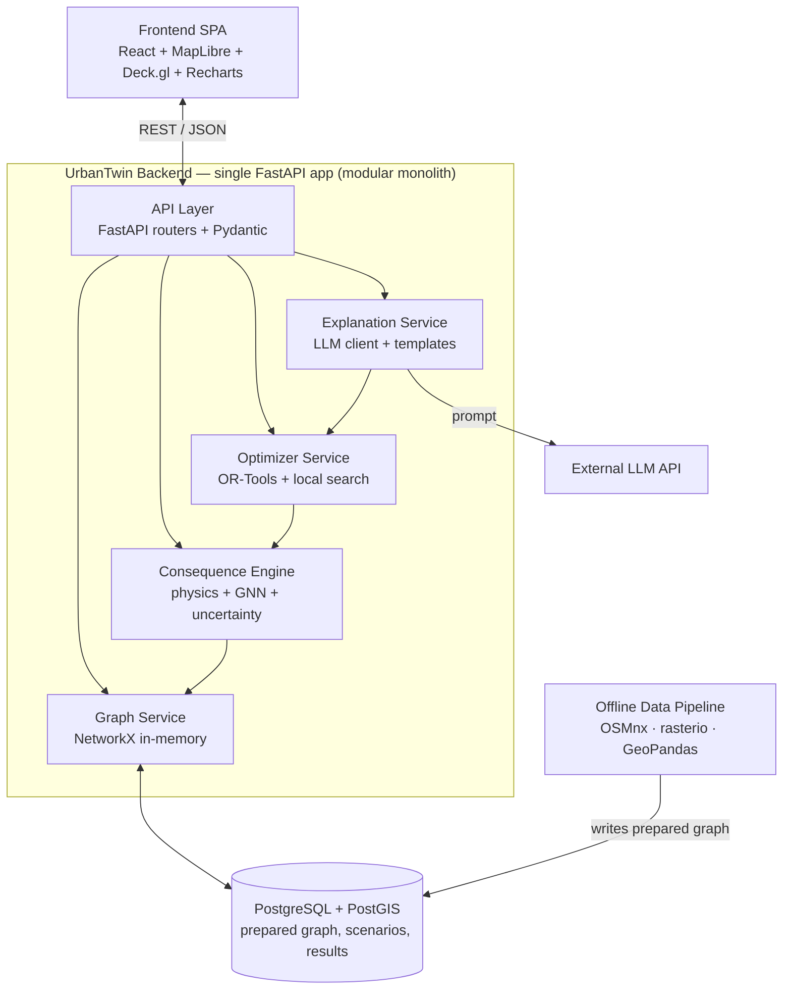
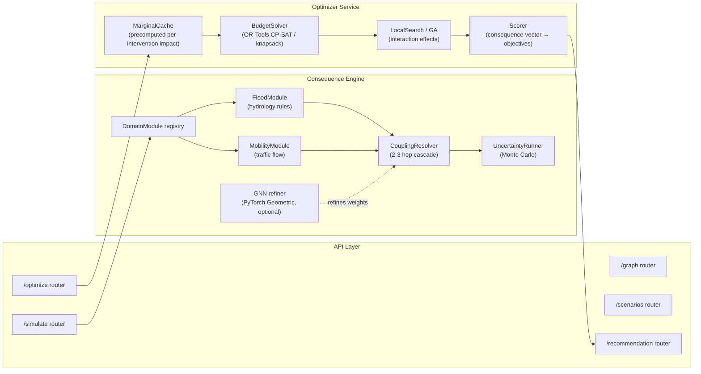
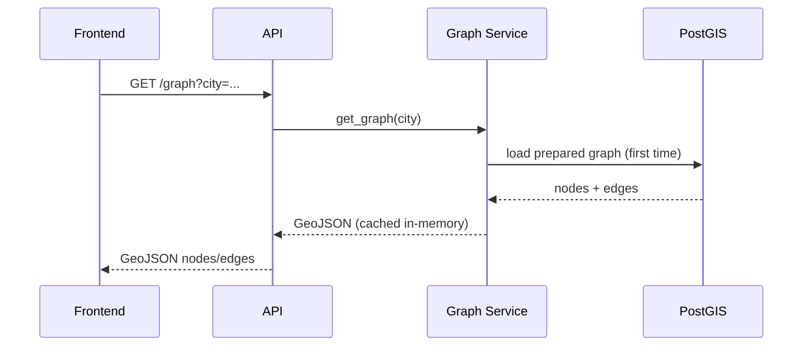
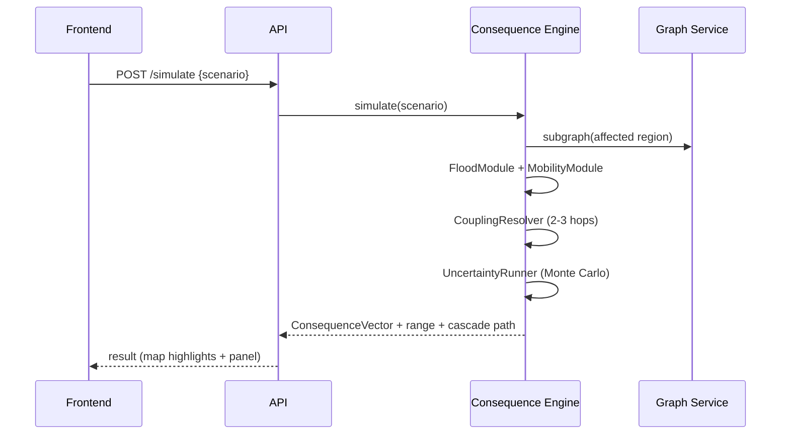
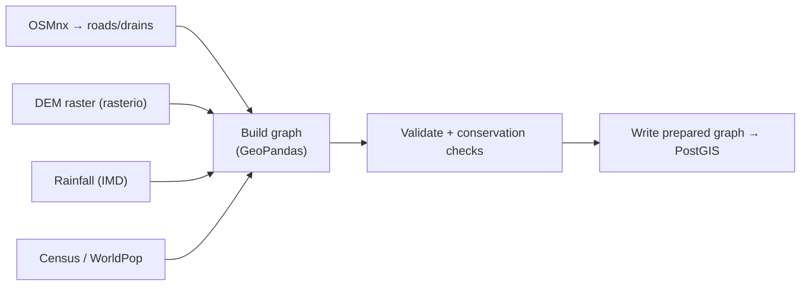
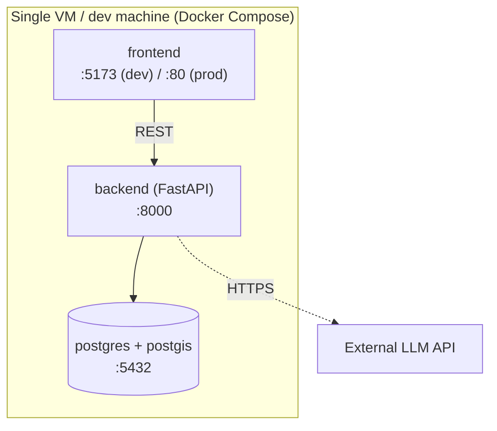

# System Architecture
## AI Infrastructure Consequence & Decision Simulator — **UrbanTwin**

| Field | Value |
|---|---|
| **Document** | System Architecture (companion to [PRD.md](PRD.md)) |
| **Version** | 1.0 (draft) |
| **Date** | 2026-08-24 |
| **Backend** | Python 3.11+ · FastAPI |
| **Frontend** | React · MapLibre GL JS · Deck.gl |
| **Architecture style** | **Modular monolith (MVP), microservice-ready boundaries** |
| **Depth domains** | Flooding ↔ Mobility |

> Read alongside the PRD. The PRD says *what* and *why*; this doc says *how it fits together* and is the build reference for the 96-hour team.

---

## 1. Architecture Goals & Principles

1. **Three separable layers, never one blob.** Graph → Consequence → Decision. Each layer is independently testable and replaceable.
2. **Physics baseline is the safety net.** The system must produce a valid answer using deterministic physics even if the GNN or LLM is unavailable.
3. **Decisions are deterministic & auditable.** The optimizer (OR-Tools) makes the ranking; same inputs → same output (seeded). The LLM only narrates.
4. **Explainability by construction.** The "why" comes from the trade-off table + optimizer reasoning, not from interpreting a black box after the fact.
5. **Domains are plug-ins.** Every domain implements one interface (`DomainModule.compute_impact`). Adding water/economy later must not touch the optimizer or UI.
6. **Modular monolith now, microservice-ready later.** One deployable FastAPI app with clean internal service boundaries; each boundary is a future extraction point.
7. **Stateless request path, cached read-model.** The heavy graph is prepared offline and held in memory; requests are fast and horizontally scalable.

---

## 2. C4 Level 1 — System Context



**Boundary:** UrbanTwin consumes **open data** (prepared offline) and calls an **external LLM** purely to turn numbers into prose. No personal data enters the system.

---

## 3. C4 Level 2 — Container View



**Containers:**

| Container | Responsibility |
|---|---|
| **Frontend SPA** | Map + graph rendering, scenario builder, trade-off dashboard, cascade animation |
| **API Layer** | HTTP surface, validation, request orchestration across services |
| **Graph Service** | Owns the in-memory infrastructure graph; queries, subgraphs, node/edge lookups |
| **Consequence Engine** | Simulates cascading impact of a scenario (physics baseline + optional GNN refinement + uncertainty) |
| **Optimizer Service** | Selects/ranks intervention bundles under budget (multi-objective) |
| **Explanation Service** | Turns optimizer output into a plain-language recommendation (LLM, with template fallback) |
| **PostgreSQL + PostGIS** | Persistence: prepared graph, saved scenarios, cached results |
| **Offline Data Pipeline** | One-time/periodic prep of raw open data → clean graph (not on the request path) |

---

## 4. C4 Level 3 — Component View (inside the backend)



**Key contracts:**
- `DomainModule.compute_impact(graph, intervention, context) -> ConsequenceVector`
- `CouplingResolver.propagate(base_impacts, graph, max_hops=3) -> CascadeResult`
- `BudgetSolver.solve(interventions, budget, objectives) -> RankedBundles`

---

## 5. The Three Layers in Depth

### 5.1 Layer 1 — Digital Twin (Graph)
- **Store:** prepared in **PostGIS**, loaded into an **in-memory NetworkX** graph at startup (read-model). Optional Neo4j deferred (see ADR-2).
- **Nodes:** `road_segment`, `drain`, `pump`, `hospital`, `ward`, … with attributes (elevation, capacity, population_served).
- **Edges (dependencies):** `protects`, `connects`, `supplies`, `drains_to`, each with a **weight** (physics-initialized, optionally GNN-refined).
- **Access:** Graph Service exposes read-only queries + fast subgraph extraction for a scenario's affected region.

### 5.2 Layer 2 — Consequence Engine
- **Physics baseline (always on):**
  - *Flood:* elevation + rainfall → flow accumulation → ponded/affected nodes.
  - *Mobility:* flooded roads → capacity drop → travel-time increase (flow/capacity relation).
- **Coupling:** `CouplingResolver` propagates impact across edges, **bounded to 2–3 hops** to stop error compounding.
- **Uncertainty:** `UncertaintyRunner` does **Monte-Carlo** over uncertain params (rainfall intensity, edge weights) → outputs **ranges/confidence**, not point values.
- **GNN refiner (optional/stretch):** PyTorch Geometric model that **refines edge weights / cascade strength** on top of the physics baseline. If absent, physics stands alone.
- **Guardrails:** conservation checks (water in ≈ out, traffic conserved) reject implausible sims.

### 5.3 Layer 3 — Decision Engine
- **MarginalCache:** each intervention's marginal consequence is computed **once**, then reused — avoids re-simulating per bundle.
- **BudgetSolver:** **OR-Tools CP-SAT / 0-1 knapsack** selects the best bundle under budget across weighted objectives.
- **LocalSearch / GA:** refines for **interaction effects** (synergy/conflict) the linear model misses.
- **Explanation:** Explanation Service sends the ranked numbers to the **LLM to narrate**; a **template fallback** produces a deterministic explanation if the LLM is down. *The LLM never changes the ranking.*

---

## 6. Runtime Flows (Sequence Diagrams)

### 6.1 Load graph


### 6.2 Simulate one scenario (what-if)


### 6.3 Optimize under budget → recommendation
```mermaid
sequenceDiagram
    participant FE as Frontend
    participant API
    participant OPT as Optimizer
    participant CE as Consequence Engine
    participant EXP as Explanation
    participant LLM
    FE->>API: POST /optimize {budget, interventions}
    API->>OPT: solve(budget, interventions)
    OPT->>CE: marginal impact per intervention (cached)
    CE-->>OPT: consequence vectors
    OPT->>OPT: BudgetSolver + LocalSearch
    OPT-->>API: ranked bundles + trade-off table
    API->>EXP: explain(top options)
    EXP->>LLM: narrate numbers  (fallback: template)
    LLM-->>EXP: plain-language text
    EXP-->>API: recommendation
    API-->>FE: ranked options + trade-offs + "why"
```

---

## 7. Data Architecture

### 7.1 Core schema (indicative)
```jsonc
// Node
{ "id": "road_42", "type": "road_segment",
  "geometry": { "type": "LineString", "coordinates": [] },
  "attributes": { "elevation_m": 12.4, "capacity": 1800, "population_served": 5400 } }

// Edge (dependency)
{ "source": "drain_17", "target": "road_42",
  "type": "protects", "weight": 0.7 }

// Intervention
{ "id": "int_09", "name": "Upgrade Drain-17", "target": "drain_17",
  "cost": 1200000, "effect": { "drain_capacity_mult": 1.8 }, "duration_weeks": 3 }

// Scenario
{ "id": "scn_B", "budget": 5000000, "interventions": ["int_09","int_03"] }
```

### 7.2 Storage strategy
| Data | Where | Why |
|---|---|---|
| Prepared graph (nodes/edges) | **PostGIS** tables | Geospatial queries, durable |
| Live working graph | **In-memory NetworkX** | Fast traversal during simulation |
| Interventions catalog | Postgres | Small, relational |
| Scenarios & cached results | Postgres (JSONB) | Auditability, reproducibility |
| Precomputed marginals | In-memory cache (+ optional Redis later) | Optimizer speed |

### 7.3 Offline data pipeline (not on request path)

Runs once (or periodically) to produce a clean, demo-ready city graph. Keeps the live app fast and deterministic.

---

## 8. API Contract

| Method & Path | Purpose |
|---|---|
| `GET /healthz` | Liveness/readiness |
| `GET /graph` | City graph as GeoJSON |
| `GET /interventions` | Candidate interventions catalog |
| `POST /scenarios` | Create/auto-generate alternative scenarios from a budget |
| `POST /simulate` | Run consequence engine for one scenario |
| `POST /optimize` | Best bundle(s) under budget |
| `GET /recommendation/{id}` | Ranked options + trade-off table + explanation |

**Representative `POST /simulate` response:**
```jsonc
{
  "scenario_id": "scn_B",
  "consequence": {
    "cost": 4200000,
    "risk_reduction": { "value": 0.34, "low": 0.27, "high": 0.41 },
    "population_protected": { "value": 12400, "low": 9800, "high": 15200 },
    "mobility_disruption_min": { "value": 8.5, "low": 6.1, "high": 11.0 },
    "service_availability": 0.91
  },
  "cascade_path": ["drain_17","road_42","hospital_3"],
  "confidence": "medium",
  "dominant_uncertainty": "rainfall_intensity"
}
```

**Representative `GET /recommendation/{id}` response:**
```jsonc
{
  "budget": 5000000,
  "ranked": [
    { "scenario_id": "scn_B", "rank": 1, "score": 0.82, "consequence": { } },
    { "scenario_id": "scn_A", "rank": 2, "score": 0.74, "consequence": { } }
  ],
  "explanation": "We recommend Strategy B. For 8 lakh less than A, it protects ~12,400 more residents and keeps 3 more arterial roads passable, at the cost of ~2 extra weeks of disruption. Confidence: medium (rainfall assumption dominant).",
  "explanation_source": "llm"   // or "template" (fallback)
}
```

---

## 9. Technology Stack per Container

| Container / concern | Technology | Rationale |
|---|---|---|
| API | FastAPI, Pydantic v2, Uvicorn | Async, typed, auto OpenAPI at `/docs` |
| Graph | NetworkX (+ PostGIS) | Standard graph algos; fast in-memory |
| GNN (optional) | PyTorch Geometric | Spatio-temporal cascade refinement |
| Physics | NumPy / SciPy | Hydrology + traffic-flow rules |
| Optimizer | Google OR-Tools (CP-SAT) | Exact budget-constrained selection |
| Explanation | LLM via API + Jinja templates | Narration with deterministic fallback |
| DB | PostgreSQL + PostGIS | Relational + geospatial |
| Data prep | OSMnx, GeoPandas, rasterio | Build graph from open data |
| Frontend | React + MapLibre GL + Deck.gl + Recharts | Interactive map, graph overlays, charts |
| Packaging | Docker + Docker Compose | Reproducible one-command run |

---

## 10. Deployment Architecture



- **Local/dev:** `docker compose up` → Postgres + FastAPI + Vite dev server. Graph pipeline run once via a `make seed` / one-off container.
- **Prod (demo/pilot):** same compose on a single VM; frontend built to static assets served by Nginx; backend behind Uvicorn/Gunicorn workers.
- **Config:** 12-factor via env vars (`DATABASE_URL`, `LLM_API_KEY`, `CORS_ORIGINS`, `CITY_ID`, `RANDOM_SEED`). Secrets never committed; `.env` + `.env.example`.

---

## 11. Cross-Cutting Concerns

| Concern | Approach |
|---|---|
| **Config & secrets** | Pydantic `Settings`, env-driven, `.env.example` checked in |
| **Caching** | In-memory graph + precomputed marginals; Redis is a later add for multi-instance |
| **Concurrency** | Async I/O for API; CPU-heavy simulation offloaded to a worker/threadpool (or Celery later) so requests don't block |
| **Error handling** | Typed exceptions → consistent JSON errors; **physics fallback** if GNN fails; **template fallback** if LLM fails; **greedy fallback** if solver times out |
| **Security** | CORS locked to frontend origin; read-only open data; **no PII**; input validation via Pydantic; rate-limit LLM calls |
| **Observability** | Structured JSON logs, `/healthz`, per-layer timing metrics, request IDs |
| **Reproducibility** | Global `RANDOM_SEED`; same inputs → same ranking; results persisted for audit |

---

## 12. Scalability & Performance

- **Graph size:** in-memory NetworkX handles ~50k nodes comfortably for a city/district; beyond that, partition by region or move to a graph DB.
- **Scenario throughput:** simulations are independent → **parallelizable** across workers; marginals cached so optimization is cheap.
- **Latency targets:** single sim < 2 s; optimize ≤ 100 interventions < 5 s (see PRD §16).
- **Microservice split (when needed):** the four services already have clean boundaries; the **Consequence Engine** (CPU/GPU-heavy) is the first natural extraction, followed by the Optimizer. API stays as the gateway.
- **Scaling reads:** stateless API replicas behind a load balancer; shared read-model via Redis/graph cache.

---

## 13. Proposed Repository Structure

```
urbantwin/
├─ docker-compose.yml
├─ .env.example
├─ README.md
├─ PRD.md
├─ ARCHITECTURE.md
├─ backend/
│  ├─ pyproject.toml
│  ├─ app/
│  │  ├─ main.py                 # FastAPI app factory
│  │  ├─ config.py               # Pydantic Settings
│  │  ├─ api/routers/            # graph, scenarios, simulate, optimize, recommendation
│  │  ├─ services/
│  │  │  ├─ graph_service.py
│  │  │  ├─ consequence/         # engine, coupling, uncertainty, gnn
│  │  │  │  └─ domains/          # flood.py, mobility.py, base.py (DomainModule)
│  │  │  ├─ optimizer/           # solver.py, local_search.py, scorer.py, marginal_cache.py
│  │  │  └─ explanation/         # llm_client.py, templates/
│  │  ├─ models/                 # Pydantic + ORM schemas
│  │  └─ db/                     # session, migrations
│  ├─ pipeline/                  # offline: build_graph.py (OSMnx/DEM/rainfall/census)
│  └─ tests/                     # unit + synthetic-twin validation
├─ frontend/
│  ├─ package.json
│  └─ src/
│     ├─ components/  (MapView, ScenarioBuilder, TradeoffTable, CascadeLayer)
│     ├─ api/         (client)
│     └─ state/
└─ data/                         # prepared graph artifacts (gitignored)
```

---

## 14. Architecture Decision Records (ADR-lite)

| # | Decision | Why | Trade-off |
|---|---|---|---|
| **ADR-1** | **Modular monolith** for MVP | Fastest to build in 96h; one deploy; clean internal boundaries | Must resist coupling across service modules |
| **ADR-2** | **NetworkX (+PostGIS)**, defer Neo4j | No new infra to learn; in-memory is fast enough for one city | Very large multi-city graphs may later need a graph DB |
| **ADR-3** | **Physics + GNN hybrid**, physics-first | Correct baseline without labeled data; GNN is additive | GNN accuracy gains are stretch, not guaranteed |
| **ADR-4** | **OR-Tools makes the decision** | Deterministic, exact, auditable under budget | Objective weights must be explicit/tuned |
| **ADR-5** | **LLM = narration only** | Keeps decisions reproducible; avoids black-box gimmick | Explanation quality depends on prompt; has template fallback |
| **ADR-6** | **MapLibre + Deck.gl** frontend | Open-source, no API-key lock-in, great for graph/geo overlays | Slightly more setup than a hosted map SDK |

---

## 15. Failure Modes & Fallbacks

| Component fails | Fallback | User impact |
|---|---|---|
| **GNN model** unavailable/slow | Physics baseline only | Slightly coarser cascade; still valid ranking |
| **Optimizer** times out | Greedy selection under budget | Near-optimal bundle, fast |
| **LLM API** down/rate-limited | Deterministic template explanation | Plainer wording, same numbers |
| **DB** unreachable at request time | Serve from in-memory graph cache | Reads keep working; writes queued |
| **Bad/implausible sim** | Conservation-check rejects, flags low confidence | Honest uncertainty instead of garbage |

**Principle:** every layer degrades to a **simpler, still-correct** behavior — the demo never hard-fails.

---

## 16. Appendix

- **Glossary & research pointers:** see [PRD.md](PRD.md) §23 (digital twin, GNN, ILP, cascade; DCRNN/Graph WaveNet, OR-Tools, interdependent-network models).
- **Diagram legend:** rounded/box nodes = components/containers; cylinders = datastores; dashed arrows = optional/refinement paths; solid arrows = primary data flow.
- **Cross-refs:** PRD §6 (three-layer overview), §9 (container summary), §12 (ML methodology), §17 (96h plan), §20–21 (risks & validation).

*End of System Architecture v1.0 (draft).*
