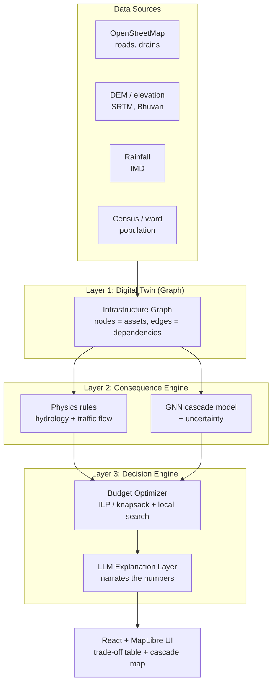

# Product Requirements Document (PRD)
## AI Infrastructure Consequence & Decision Simulator

| Field | Value |
|---|---|
| **Product name** | AI Infrastructure Consequence & Decision Simulator (working name: **UrbanTwin**) |
| **Version** | 1.0 (draft) |
| **Date** | 2026-08-24 |
| **Status** | Draft — for 96h hackathon build + real-product vision |
| **Owner** | rknishok@gmail.com |
| **Backend** | Python + FastAPI |
| **Frontend** | React + MapLibre GL JS + Deck.gl |
| **Depth demo** | Flooding ↔ Mobility (other domains = extensible modules) |

---

## 1. Executive Summary & Vision

Cities today evaluate infrastructure projects **in isolation** — fix a road, upgrade a drain, expand a clinic — one budget line at a time. But infrastructure is a **network**: fixing a drain changes flood risk, which changes road usability, which changes ambulance response times, which changes hospital load. Today no widely-used tool answers the real question a planner faces:

> **"For this budget, what happens if we choose intervention A instead of B — across *all* interconnected systems?"**

**UrbanTwin** builds a digital representation of a city's interconnected infrastructure, generates alternative intervention scenarios, predicts their **downstream cascading consequences**, and returns a **budget-optimized, explainable recommendation** with clear trade-offs.

**The shift we enable:** from *isolated, reactive project selection* → to *predictive, consequence-aware, budget-optimized decision-making*.

**One-line pitch:** *"A flight simulator for city infrastructure decisions."*

---

## 2. Problem Statement

- Infrastructure decisions are made **domain-by-domain**, ignoring cross-system coupling.
- Consequences of an intervention **cascade** across mobility, flooding, public services, population exposure, environmental risk, and local economy — but planners can't see or compare these effects.
- Existing tools are **fragmented** (single-domain simulators, GIS dashboards, spreadsheets) and offer **no unified, budget-constrained, consequence-aware comparison**.
- The result: money spent on interventions that look good in isolation but are **suboptimal or even harmful** system-wide.

**Gap we fill:** a unified, AI-driven **consequence + decision** framework that reasons across interconnected systems under a budget constraint, and *explains its reasoning*.

---

## 3. Goals & Non-Goals

### 3.1 Goals
- Model a city as an **interconnected infrastructure graph**.
- Let users define a **budget** and **candidate interventions**, and auto-generate alternative strategies.
- **Simulate cascading consequences** of each strategy across coupled domains (v1: flooding ↔ mobility).
- **Optimize** the intervention bundle for a given budget across multiple objectives.
- Produce an **explainable recommendation**: ranked options with trade-off table + plain-language "why".
- Ship a **demoable MVP in 96 hours** that is architecturally honest as a real product.

### 3.2 Non-Goals (v1)
- ❌ **Not** absolute-value predictions ("prevents exactly 4,200 flood incidents"). We output **relative rankings + uncertainty ranges**.
- ❌ **Not** all six domains at full fidelity. v1 goes **deep on flooding ↔ mobility**; other domains are stubs/modules.
- ❌ **Not** an autonomous decision-maker. It is **decision *support*** — a human authority decides.
- ❌ **Not** real-time IoT/sensor ingestion in v1 (roadmap item).
- ❌ **Not** a financial/GIS system of record; it consumes open data, it doesn't replace municipal ERPs.

---

## 4. Target Users & Personas

| Persona | Role | What they need from UrbanTwin |
|---|---|---|
| **Meera — Municipal Engineer** | Plans & sequences physical works | Which projects to fund first; what breaks if a project is delayed |
| **Rajesh — City Budget/Finance Officer** | Allocates a fixed capital budget | For ₹X, the bundle with the best risk-reduction-per-rupee |
| **Anita — Disaster Management Cell** | Flood/emergency resilience | Which interventions most reduce population exposure & keep mobility during floods |
| **Sundar — Urban Planner / Commissioner** | Strategic, cross-domain calls | A defensible, explainable comparison to justify decisions to the public/council |

**Primary persona for the demo:** **Rajesh (budget officer)** — the budget-vs-consequence trade-off is the sharpest, most demoable story.

---

## 5. Key Use Cases & User Stories

- **US-1 (Compare):** *As a budget officer, given ₹5 crore, I want to compare 3 strategies ranked by risk reduction and population protected, so I can justify the best allocation.*
- **US-2 (What-if):** *As an engineer, I want to toggle "upgrade Drain-42" on/off and see the downstream effect on road flooding and travel time, so I understand coupling.*
- **US-3 (Optimize):** *As a planner, I want the system to auto-select the best bundle of interventions under my budget, so I don't hand-search combinations.*
- **US-4 (Explain):** *As a commissioner, I want a plain-language explanation of why Option B beats Option A, so I can defend it publicly.*
- **US-5 (Cascade view):** *As a disaster officer, I want to visually see how a flood at one node cascades to hospitals and roads, so I can prioritize resilience.*

---

## 6. Solution Overview — The Three-Layer Architecture

The single most important design decision: **UrbanTwin is three separable layers, not one monolithic model.** This is what makes it accurate, explainable, and debuggable.



**Layer responsibilities:**

1. **Digital Twin (Graph):** nodes = assets (road segments, drains, pumps, hospitals, wards); edges = physical/functional dependencies (a drain protects a road; a road connects a ward to a hospital).
2. **Consequence Engine:** given an intervention, propagate downstream effects across edges. **Hybrid = physics rules where we have equations (hydrology, traffic) + GNN where we have data**, always with **uncertainty attached**.
3. **Decision Engine:** given a budget, search over intervention bundles and **rank them via optimization** (OR-Tools). The **LLM narrates** the optimizer's numeric output into an explanation — it **never makes the decision** (keeps it reproducible & auditable).

---

## 7. Scope (v1)

| In scope (v1 depth) | Extensible module (stub in v1) |
|---|---|
| **Flooding** domain (drainage, elevation, rainfall) | Water supply network |
| **Mobility** domain (road network, travel time) | Public services (hospitals/schools availability) |
| Flooding ↔ Mobility **coupling** | Environmental risk |
| Budget optimizer + trade-off comparison | Local economic activity |
| Explainable recommendation | Real-time sensor feeds |

**Design principle:** every domain implements a common **`DomainModule` interface** (`compute_impact(graph, intervention) -> ConsequenceVector`), so new domains plug in without touching the optimizer or UI.

---

## 8. Functional Requirements

| ID | Requirement | Priority |
|---|---|---|
| **FR-1** | Load & render a city infrastructure graph on a map | P0 |
| **FR-2** | Define a budget and a catalog of candidate interventions (cost, type, target node) | P0 |
| **FR-3** | Auto-generate ≥3 alternative intervention strategies | P0 |
| **FR-4** | Simulate cascading consequences of a strategy (flooding ↔ mobility), with uncertainty | P0 |
| **FR-5** | Optimize: select the best bundle under budget across objectives | P0 |
| **FR-6** | Produce a trade-off comparison table across scenarios | P0 |
| **FR-7** | Generate a plain-language, explainable recommendation | P0 |
| **FR-8** | Visualize cascade propagation on the map (animated/highlighted) | P1 |
| **FR-9** | "What-if" toggle: enable/disable a single intervention and see delta | P1 |
| **FR-10** | Export recommendation as PDF/shareable report | P2 |
| **FR-11** | Plug-in interface for additional domains | P1 |

---

## 9. System Architecture

```
┌────────────────────────────────────────────────────────────────┐
│  Frontend  (React + MapLibre GL + Deck.gl + Recharts)           │
│  • Map & graph view   • Scenario builder   • Trade-off dashboard │
└───────────────▲───────────────────────────────┬────────────────┘
                │ REST/JSON                       │
┌───────────────┴───────────────────────────────▼────────────────┐
│  API Gateway  (FastAPI + Pydantic + Uvicorn)                    │
│  /graph  /scenarios  /simulate  /optimize  /recommendation      │
└───┬───────────────┬──────────────────┬───────────────┬─────────┘
    │               │                  │               │
┌───▼─────┐  ┌──────▼───────┐  ┌───────▼──────┐  ┌─────▼────────┐
│ Graph   │  │ Consequence  │  │ Optimizer    │  │ Explanation  │
│ Service │  │ Engine       │  │ Service      │  │ Service (LLM)│
│NetworkX │  │physics + GNN │  │ OR-Tools     │  │ API-based    │
│PostGIS  │  │PyTorch Geom. │  │ + local srch │  │              │
└─────────┘  └──────────────┘  └──────────────┘  └──────────────┘
    │
┌───▼──────────────────────────────────────────────────────────┐
│  Data store: PostgreSQL + PostGIS  (graph cached in-memory)   │
│  Preprocessed: OSM, DEM, rainfall, census                     │
└───────────────────────────────────────────────────────────────┘
```

**Key flow:** UI builds a scenario → `POST /simulate` runs the consequence engine per scenario → `POST /optimize` ranks bundles under budget → `GET /recommendation` returns ranked options + trade-off table + LLM explanation → UI renders map + dashboard.

---

## 10. Technology Stack

| Layer | Choice | Why |
|---|---|---|
| **Backend API** | Python 3.11+, **FastAPI**, Pydantic v2, Uvicorn | Async, typed, auto OpenAPI docs |
| **Graph** | **NetworkX** (in-memory), PostGIS for geospatial | Fast to build; standard graph algorithms |
| **GNN** | **PyTorch Geometric** (or DGL) | Spatio-temporal cascade modeling |
| **Physics** | NumPy/SciPy; simple hydrology + traffic-flow rules | Correctness where data is absent |
| **Optimization** | **Google OR-Tools** (CP-SAT / knapsack) + greedy/local search / GA | Budget-constrained multi-objective selection |
| **Explanation** | LLM via API (Claude/OpenAI-compatible) | Narrate numbers → language, **not** decide |
| **DB** | PostgreSQL + **PostGIS** | Geospatial + relational |
| **Frontend** | **React** + **MapLibre GL JS** + **Deck.gl** + **Recharts** | Interactive map + graph overlays + charts |
| **Data prep** | GeoPandas, OSMnx, rasterio | OSM graphs, DEM rasters |
| **Deploy** | Docker Compose; single VM or free-tier | Simple, reproducible demo |

> **Note:** For a 96h build, GNN can start as a **learned edge-weight refiner on top of the physics baseline** rather than a from-scratch trained model. Physics gives a correct baseline on Day 2; GNN improves ranking on Day 3–4 if time allows. **The physics baseline is the safety net that guarantees a working demo.**

---

## 11. Data Requirements & Sources

| Data | Source | Use | License note |
|---|---|---|---|
| Road & drainage topology | **OpenStreetMap** (via OSMnx) | Graph nodes/edges | ODbL — attribute |
| Elevation (DEM) | **SRTM** (30m), **Bhuvan/ISRO** (India) | Flood flow direction, low-lying areas | Open / register |
| Rainfall | **IMD**, open weather APIs | Flood scenario driver | Check terms |
| Population / wards | **Census**, WorldPop, city open-data portals | Population exposure | Open |
| City open data | Municipal open-data portals | Assets, budgets | Varies |

**Strategy:** pick **one city / one district** with good OSM coverage for the demo (e.g., a known flood-prone ward). Preprocess offline into a cached graph; the live app loads the prepared graph.

---

## 12. AI/ML Methodology (accuracy-first)

This section is the heart of "make it accurate." Each choice below is a defense against a specific failure mode.

1. **Hybrid physics + GNN.** Model flooding with **hydrological rules** (elevation → flow accumulation → ponding) and mobility with **traffic-flow relations** (flow/capacity → travel-time). Use the **GNN only to refine** edge weights / cascade strength where we have signal. → *Correctness where labels don't exist.*
2. **Uncertainty on every output.** Monte-Carlo over uncertain parameters (rainfall intensity, edge weights) → report **ranges / confidence**, not false-precision points. → *Prevents confident-but-wrong outputs.*
3. **Bounded cascade depth (2–3 hops).** Don't propagate infinitely; deep cascades accumulate nonsense. → *Controls error compounding.*
4. **Conservation sanity checks.** Water in ≈ water out; traffic volume conserved; total spend ≤ budget. Reject simulations that violate. → *Physical plausibility guardrail.*
5. **Optimization, not learned decisions.** Budget-constrained **0/1 knapsack / ILP** for selection; **greedy + local search / GA** for interacting (synergy/conflict) effects. Precompute each intervention's marginal consequence once, then optimize over cached values. → *Handles combinatorial explosion; reproducible.*
6. **LLM = narration only.** The optimizer produces the ranking; the LLM turns numbers into "we recommend B over A because…". → *Explainable + auditable; no black-box decisions.*

**Explainability of the GNN itself (P1):** attention weights / GNNExplainer to highlight **which dependency edges drove a cascade** — a visual "why" on the map.

---

## 13. Explainability & Trade-off Model

Every scenario is scored on a **consequence vector**:

| Dimension | Meaning | Direction |
|---|---|---|
| **Cost** | ₹ spent | lower better |
| **Risk reduction** | Δ flood risk avoided | higher better |
| **Population affected** | residents exposed/protected | protect more |
| **Mobility disruption** | added travel time / roads cut | lower better |
| **Environmental impact** | ecological cost/benefit | lower harm |
| **Service availability** | hospitals/schools reachable | higher better |
| **Cascade effects** | net downstream secondary impact | net positive |

The UI shows a **side-by-side trade-off table** + a normalized **radar/bar chart** per scenario, plus the LLM's paragraph:
> *"We recommend Strategy B. For ₹8 lakh less than A, it protects ~12,000 more residents from flooding and keeps 3 more arterial roads passable, at the cost of ~2 extra weeks of construction disruption. Confidence: medium (rainfall assumption dominant)."*

---

## 14. Data Model / Graph Schema (indicative)

```jsonc
// Node
{
  "id": "road_42",
  "type": "road_segment",          // road_segment | drain | pump | hospital | ward | ...
  "geometry": { "type": "LineString", "coordinates": [...] },
  "attributes": { "elevation_m": 12.4, "capacity": 1800, "population_served": 5400 }
}
// Edge (dependency)
{
  "source": "drain_17", "target": "road_42",
  "type": "protects",              // protects | connects | supplies | drains_to
  "weight": 0.7                    // dependency strength (physics init; GNN-refined)
}
// Intervention
{
  "id": "int_09", "name": "Upgrade Drain-17",
  "target": "drain_17", "cost": 1200000,
  "effect": { "drain_capacity_mult": 1.8 }, "duration_weeks": 3
}
// Scenario = budget + set of interventions
{ "id": "scn_B", "budget": 5000000, "interventions": ["int_09","int_03"] }
```

---

## 15. API Design (FastAPI)

| Method & Path | Purpose | Body / returns |
|---|---|---|
| `GET /graph` | Load city graph | GeoJSON nodes/edges |
| `GET /interventions` | Catalog of candidate interventions | list |
| `POST /scenarios` | Create/generate alternative scenarios | budget → scenarios[] |
| `POST /simulate` | Run consequence engine for a scenario | scenario → consequence vector + uncertainty + cascade path |
| `POST /optimize` | Best bundle under budget | budget + interventions → ranked bundles |
| `GET /recommendation/{id}` | Final ranked options + trade-offs + explanation | recommendation object |
| `GET /healthz` | Health check | ok |

Auto-generated Swagger at `/docs` (FastAPI) — useful for the demo & judging.

---

## 16. Non-Functional Requirements

| Category | Target (v1) |
|---|---|
| **Performance** | Single-scenario simulation < 2 s; optimize ≤ 100 interventions < 5 s |
| **Reproducibility** | Same inputs → same ranking (seeded); every decision auditable |
| **Scalability** | Graph up to ~50k nodes in-memory; scenario sim parallelizable |
| **Reliability** | Physics baseline always available even if GNN fails |
| **Security** | Read-only public/open data; no PII; CORS locked to frontend origin |
| **Accessibility** | Color-blind-safe map palette; keyboard-navigable dashboard |
| **Observability** | Structured logs; `/healthz`; timing metrics per layer |

---

## 17. 96-Hour MVP Build Plan (4 days)

**Team of ~4:** 1 Data/Graph, 1 ML/Consequence, 1 Backend/Optimizer, 1 Frontend. (Solo? Follow the same order, cut P1/P2.)

### Day 1 (0–24h) — Data + Digital Twin
- Pick target city/ward with good OSM coverage.
- Build graph with **OSMnx** (roads) + drains + elevation from DEM → NetworkX + PostGIS.
- Define node/edge/intervention schema; seed a **catalog of ~15–25 candidate interventions** with costs.
- FastAPI skeleton: `/graph`, `/interventions`, `/healthz`.
- Frontend skeleton: render graph on **MapLibre**.
- **End-of-day demo:** map shows the city graph.

### Day 2 (24–48h) — Consequence Engine (physics baseline)
- Implement **flood model** (elevation → ponding → affected nodes) + **mobility model** (flooded roads → travel-time increase).
- Implement **coupling** (flood cascades to roads to services), bounded to 2–3 hops, with a Monte-Carlo uncertainty pass.
- `POST /simulate` returns consequence vector + cascade path + uncertainty.
- Frontend: animate/highlight cascade on map; show a single-scenario result panel.
- **End-of-day demo:** toggle an intervention → see downstream flooding/mobility change.

### Day 3 (48–72h) — Optimizer + Scenario Comparison
- Implement **OR-Tools knapsack/ILP** budget optimizer over precomputed marginal consequences; add greedy/local-search for interactions.
- `POST /scenarios`, `POST /optimize`, `GET /recommendation`.
- Frontend: **scenario builder** (set budget) + **trade-off table** + radar/bar charts (Recharts).
- (If time) GNN edge-weight refiner on top of physics.
- **End-of-day demo:** enter budget → get ranked strategies with trade-offs.

### Day 4 (72–96h) — Explainability, Validation, Polish
- **LLM explanation layer**: numbers → recommendation paragraph.
- **Synthetic-twin validation** (Section 19) to prove ranking correctness — a killer judging slide.
- Polish UI, color palette, empty/error states; write **demo script**; record backup video.
- **Final demo:** *"For ₹5 crore, here are 3 strategies; we recommend B; here's why; here's the proof our ranking is right."*

**Cut-line rule:** protect P0 features. GNN, PDF export, extra domains are the first to cut.

---

## 18. MVP vs. Full-Product Roadmap

| Phase | Scope |
|---|---|
| **v1 — Hackathon MVP** | 1 city, flooding ↔ mobility, physics+optional GNN, optimizer, explanation, synthetic-twin validation |
| **v2 — Pilot** | Real historical calibration (2–3 events), add water + public-services domains, PDF reports, auth & multi-user |
| **v3 — Product** | Multi-city, real-time sensor/IoT feeds, full 6-domain modules, scenario library, role-based dashboards |
| **v4 — Platform** | API for third parties, what-if collaboration, budget-cycle integration, procurement export |

---

## 19. Success Metrics / KPIs

**Hackathon demo:**
- End-to-end flow works: budget → ranked strategies → explanation. ✅/❌
- Cascade is visible & intuitive on the map.
- Judges understand the trade-off in < 60 s.
- Validation slide shows the model **recovers the correct ranking**.

**Product KPIs:**
- **Ranking accuracy** (does it pick the truly-best bundle in validation?) — *emphasized over absolute-value accuracy.*
- Time-to-decision reduced for a planner (baseline vs. tool).
- % of recommendations accepted in pilot.
- Coverage: # domains, # cities modeled.

> **Framing rule:** always claim **relative rankings + uncertainty**, never absolute counts. This is the difference between a defensible and an indefensible demo.

---

## 20. Risks & Mitigations

| # | Risk | Mitigation |
|---|---|---|
| **R1** | **Data scarcity / no ground-truth cascade labels** | Hybrid **physics+ML** (physics needs no labels); build on **open data**; claim **rankings not absolutes** |
| **R2** | **Cascades confidently wrong** | **Uncertainty** on every output; **bound depth 2–3 hops**; **conservation checks** |
| **R3** | **Combinatorial explosion** in bundle search | **ILP/knapsack (OR-Tools)** + greedy/local search; precompute marginals |
| **R4** | **"AI reasoning" becomes a gimmick** | LLM used **only to narrate**; decision stays in deterministic optimizer |
| **R5** | **GNN opacity vs. explainability promise** | Explainability comes from **optimizer + trade-off table**; GNNExplainer as bonus "why" |
| **R6** | **Validation credibility** ("how do you know it's right?") | **Synthetic-twin experiment** (Section 21) + calibrate on 2–3 historical events |
| **R7** | **Scope creep** (6 domains × short time) | **Depth in 2 coupled domains**; others are stubbed modules behind a common interface |
| **R8** | **96h time risk** | Physics baseline guarantees a working demo Day 2; GNN/extras are cuttable |

---

## 21. Validation Strategy (the credibility slide)

**Problem:** no real labeled "intervention → outcome" data exists to prove accuracy.

**Solution — Synthetic-Twin Experiment:**
1. Build a **small simulated city** with **known, hidden** cascade rules (we author the ground truth).
2. Hide those rules from the model; feed the model only the graph + interventions.
3. Show the model **recovers the correct ranking** of strategies that the known rules imply.
4. Report **ranking metrics** (e.g., does the top-1 / top-3 match ground truth?) — not absolute error.

**Plus:** calibrate the physics model against **2–3 known historical events** (e.g., a past flood, ward-by-ward), showing the twin reproduces the observed pattern. Even a few validated cases is credible.

---

## 22. Future Extensions

- Additional domains: water supply, public services, environment, local economy.
- **Real-time** sensor/IoT & weather feeds → live risk dashboards.
- Multi-city support & benchmarking.
- Collaborative what-if sessions for planning committees.
- Integration with municipal budget cycles & procurement export.

---

## 23. Appendix

### 23.1 Glossary
- **Digital twin** — a computational model mirroring real infrastructure.
- **Cascade** — a chain of downstream effects across dependency edges.
- **GNN** — Graph Neural Network; learns over graph-structured data.
- **ILP** — Integer Linear Programming; exact constrained optimization.
- **Consequence vector** — the multi-dimensional impact score of a scenario.

### 23.2 Research / reference pointers
- **Interdependent-network cascade models:** Buldyrev et al. (coupled network failures); network percolation & resilience.
- **Spatio-temporal GNNs:** DCRNN, Graph WaveNet (traffic forecasting) — adaptable architectures.
- **Optimization:** Google OR-Tools (knapsack, CP-SAT); multi-objective infrastructure investment optimization.
- **Urban flood digital twins:** DEM + hydrology + network-graph coupling.
- **Data:** OpenStreetMap (OSMnx), SRTM/Bhuvan DEM, IMD rainfall, Census/WorldPop.

### 23.3 Open questions to resolve during build
- Which specific city/ward for the demo (OSM coverage + a known flood event)?
- GNN in v1, or physics-only baseline + GNN as stretch?
- Report export (PDF) in-scope for 96h or v2?

---

*End of PRD v1.0 (draft).*
