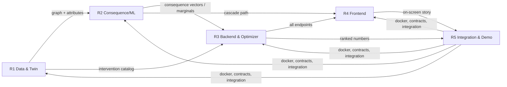

# Team Roles & Responsibilities — 5 People
## AI Infrastructure Consequence & Decision Simulator — **UrbanTwin**

| Field | Value |
|---|---|
| **Companion docs** | [PRD.md](PRD.md) · [ARCHITECTURE.md](ARCHITECTURE.md) · [IMPLEMENTATION_PLAN.md](IMPLEMENTATION_PLAN.md) |
| **Version** | 1.0 |
| **Date** | 2026-08-24 |
| **Team size** | 5 |

> Each teammate: read **your section**, then skim the others so you know your hand-offs. Day-by-day timing lives in [IMPLEMENTATION_PLAN.md](IMPLEMENTATION_PLAN.md) §5. Fill in the `[assign: ____]` name next to your role.

---

## 1. Team at a Glance

| # | Role | Owns | Primary tech | Buddy |
|---|---|---|---|---|
| **R1** | **Data & Digital Twin Engineer** — `[assign: ____]` | Data pipeline, Graph Service, PostGIS, schema | OSMnx, GeoPandas, rasterio, PostGIS, NetworkX | R2 |
| **R2** | **Consequence / ML Engineer** — `[assign: ____]` | Flood + Mobility modules, coupling, uncertainty, GNN | NumPy/SciPy, PyTorch Geometric | R1 |
| **R3** | **Backend & Optimization Engineer** — `[assign: ____]` | FastAPI API, Optimizer (OR-Tools), MarginalCache | FastAPI, Pydantic, OR-Tools | R5 |
| **R4** | **Frontend Engineer** — `[assign: ____]` | React app, map/graph viz, scenario UI, charts | React, MapLibre GL, Deck.gl, Recharts | R5 |
| **R5** | **Integration, Explainability & Demo Lead** — `[assign: ____]` | Explanation (LLM), validation, DevOps, demo, coordination | Docker, LLM API, Jinja, storytelling | R3/R4 |

**Golden rule for everyone:** serve the P0 golden path ([IMPLEMENTATION_PLAN.md](IMPLEMENTATION_PLAN.md) §8). Physics before ML. Integrate daily. Fall back, don't fail.

---

## 2. R1 — Data & Digital Twin Engineer

**Mission:** turn messy open data into one clean, queryable city graph the whole system runs on.

**Owns (ARCHITECTURE.md):** Offline Data Pipeline (§7.3), Graph Service (§5.1), PostGIS schema, graph loading/caching.

**Key skills:** OSMnx, GeoPandas, rasterio, GIS/geospatial, PostGIS, NetworkX, data cleaning.

**Day-by-day:**
- **Day 1:** Pick/confirm demo city (with R5). Build the pipeline (OSMnx roads/drains + DEM elevation + population). Produce the prepared graph → PostGIS. Make `GET /graph` return **real GeoJSON**.
- **Day 2:** Finalize node attributes R2 needs (elevation, capacity, population_served) and edge dependency types. Persist the **intervention catalog**; make `GET /interventions` real.
- **Day 3:** Build `POST /scenarios` auto-generation helper; support the optimizer's marginal precompute; data QA.
- **Day 4:** Data QA + a **backup dataset committed to `data/`**; verify reproducibility (global seed); help R4 with polish if free.

**Deliverables / DoD:** a versioned prepared graph; `GET /graph` + `GET /interventions` live and matching the frozen contract; graph loads at startup into the in-memory cache.

**Interfaces:** *Hands off to* → R2 (graph + attributes), R3 (persisted catalog). *Receives from* → R5 (city choice, infra).

**Backup for:** R2 (shares the graph/data mental model).

---

## 3. R2 — Consequence / ML Engineer

**Mission:** predict what actually happens downstream when you intervene — correctly, and with honest uncertainty.

**Owns (ARCHITECTURE.md):** Consequence Engine (§5.2) — `FloodModule`, `MobilityModule`, `CouplingResolver`, `UncertaintyRunner`, optional GNN refiner.

**Key skills:** NumPy/SciPy, basic hydrology + traffic-flow modeling, Monte Carlo, PyTorch Geometric (stretch).

**Day-by-day:**
- **Day 1:** Implement `FloodModule` + `MobilityModule` against the **mock fixture graph** (don't wait on R1). Define the `ConsequenceVector`.
- **Day 2:** Build `CouplingResolver` (bounded **2–3 hops**) + `UncertaintyRunner` (Monte Carlo). Wire to the **real** graph. Make `POST /simulate` return consequence vector + cascade path + confidence. Add conservation-check guardrails.
- **Day 3:** Precompute **marginals** for the optimizer. **Stretch:** `LocalSearch/GA` for interaction effects **or** GNN edge-weight refiner. Tune physics accuracy.
- **Day 4:** Ensure confidence labels are honest; final tuning; verify uncertainty ranges make sense on the demo scenarios.

**Deliverables / DoD:** `POST /simulate` end-to-end on real data with uncertainty; physics baseline works **without** the GNN (the safety net).

**Interfaces:** *Receives from* → R1 (graph + attributes). *Hands off to* → R3 (consequence vectors / marginals), R4 (cascade path for animation).

**Backup for:** R1.

---

## 4. R3 — Backend & Optimization Engineer

**Mission:** the API that ties it together, and the optimizer that turns consequences into a ranked, budget-respecting decision.

**Owns (ARCHITECTURE.md):** API Layer (§3), Optimizer Service (§5.3), `MarginalCache`, fallbacks & error envelope.

**Key skills:** FastAPI, Pydantic, async, Google OR-Tools (CP-SAT/knapsack), integration.

**Day-by-day:**
- **Day 1:** FastAPI app factory; **all routers stubbed to the frozen contract**; DB session; `/healthz`; consistent error format. (Unblocks R4 immediately.)
- **Day 2:** Wire `POST /simulate` → Consequence Engine; scaffold `MarginalCache`; implement **fallbacks** (physics-only if GNN absent).
- **Day 3:** Build the **Optimizer Service** — OR-Tools knapsack/CP-SAT under budget across weighted objectives; ship `POST /optimize` + `GET /recommendation` (numbers).
- **Day 4:** Performance pass (sim <2s, optimize <5s); test **every** fallback path; **freeze the API**.

**Deliverables / DoD:** all endpoints live and contract-accurate; optimizer returns ranked bundles under budget; greedy fallback if the solver times out.

**Interfaces:** *Receives from* → R2 (consequence/marginals), R1 (catalog). *Hands off to* → R5 (ranked numbers to narrate), R4 (all endpoints).

**Backup for:** R5 (integration/glue).

---

## 5. R4 — Frontend Engineer

**Mission:** make the twin, the cascade, and the decision **visible and obvious** in under 60 seconds.

**Owns (ARCHITECTURE.md):** Frontend SPA — `MapView` (MapLibre), `CascadeLayer` (Deck.gl), `ScenarioBuilder`, `TradeoffTable`, charts, app state.

**Key skills:** React, MapLibre GL JS, Deck.gl, Recharts, UX, state management.

**Day-by-day:**
- **Day 1:** React + MapLibre skeleton; render the graph from `GET /graph` (mock → real); base layout & app state.
- **Day 2:** Simulate UI — trigger a scenario, show the result panel, **animate the cascade path** (Deck.gl), and the **what-if toggle** (US-2).
- **Day 3:** `ScenarioBuilder` (budget input); `TradeoffTable`; radar/bar charts; wire `/optimize` + `/recommendation`.
- **Day 4:** Polish — empty/error/loading states; **colorblind-safe palette**; responsive; make the cascade animation the "wow" moment.

**Deliverables / DoD:** the full golden-path UI works against real endpoints; the cascade + trade-off table read clearly to a non-expert.

**Interfaces:** *Receives from* → R3 (all endpoints), R2 (cascade path shape). *Hands off to* → R5 (the on-screen story for the demo).

**Backup for:** R5 (demo polish).

---

## 6. R5 — Integration, Explainability & Demo Lead

**Mission:** keep the whole thing running as one system, explain the decision in plain language, prove it's right, and tell the story.

**Owns (ARCHITECTURE.md):** Explanation Service (§5.3 — LLM + template fallback), validation harness (synthetic twin), DevOps (`docker-compose`, `.env`), integration ownership, demo & pitch.

**Key skills:** Docker, LLM prompting, Jinja templates, systems integration, testing, storytelling/design.

**Day-by-day:**
- **Day 1:** `docker-compose` (postgres+postgis, backend, frontend) boots with one command; `.env.example`; repo hygiene/CI-lite; seed script; start the intervention catalog with R1.
- **Day 2:** Start the **synthetic-twin** validation harness; build test fixtures with R2; keep `main` green.
- **Day 3:** Build the **Explanation Service** (LLM narration + **deterministic template fallback**); wire into `GET /recommendation`; own end-to-end integration.
- **Day 4:** Finish **synthetic-twin validation** (recovers correct ranking) → **validation slide**; polish the explanation prompt; write the **demo script**; build the **pitch deck**; record the **backup video**.

**Deliverables / DoD:** one-command boot; `GET /recommendation` returns a plain-language "why" (with fallback); a validation slide proving ranking correctness; a rehearsed demo + backup video.

**Interfaces:** *Receives from* → R3 (ranked numbers), R2 (validation fixtures), R4 (on-screen story). *Hands off to* → everyone (integration, demo).

**Backup for:** R3 and R4 (floats to wherever integration hurts).

---

## 7. Collaboration & Dependency Map

**Reading it:** data flows **R1 → R2 → R3 → R5**; R4 consumes from R3/R2 and feeds the demo; R5 wraps everything (infra + integration + story).

---

## 8. Buddy / PR-Review Matrix

Pairs review each other's PRs first (fast, context-aware reviews):

| Author | First reviewer |
|---|---|
| R1 | R2 |
| R2 | R1 |
| R3 | R5 |
| R4 | R5 |
| R5 | R3 |

Keep PRs small. `main` must always boot (`docker compose up`).

---

## 9. RACI-lite (key deliverables)

**R = Responsible · A = Accountable · C = Consulted · I = Informed**

| Deliverable | R1 | R2 | R3 | R4 | R5 |
|---|---|---|---|---|---|
| Prepared city graph / `GET /graph` | **A/R** | C | I | I | I |
| `POST /simulate` (consequences) | C | **A/R** | R | I | I |
| `POST /optimize` + `/recommendation` | C | C | **A/R** | I | C |
| Frontend golden-path UI | I | C | C | **A/R** | C |
| Explanation (LLM + fallback) | I | I | C | I | **A/R** |
| Synthetic-twin validation | I | C | I | I | **A/R** |
| Docker / one-command boot | I | I | C | I | **A/R** |
| Demo & pitch | I | I | I | C | **A/R** |

---

## 10. Communication Cadence

- **Standup ×2/day** (15 min, start + end of each day): blockers, integration status, cut-line check.
- **Integration owner:** R5 keeps `main` green and services talking.
- **Milestone tags:** `m1`–`m4` at each end-of-day checkpoint ([IMPLEMENTATION_PLAN.md](IMPLEMENTATION_PLAN.md) §4).
- **Decision log:** any change to the frozen API contract is announced in the group channel and updated in [ARCHITECTURE.md](ARCHITECTURE.md) §8.

---

## 11. "If We're Behind" — Where Capacity Flows

| Situation | Shift |
|---|---|
| Data pipeline slow (Day 1–2) | R1 ships a **cached graph in `data/`**; R2 keeps using fixtures; don't block the team |
| Optimizer at risk (Day 3) | R5 pairs with R3; drop to **pure knapsack** (cut GNN/local-search first) |
| Frontend behind (Day 3–4) | R1 + R2 (their heavy work is done) help R4 with components/polish |
| Integration fires | R5 owns it; R3 assists |
| Overall behind | Follow the **cut-list** ([IMPLEMENTATION_PLAN.md](IMPLEMENTATION_PLAN.md) §10) — protect the golden path + validation slide |

**Everyone converges on the demo for the final 4 hours.** Stop building; rehearse and bug-fix only.

*End of Team Roles v1.0.*
